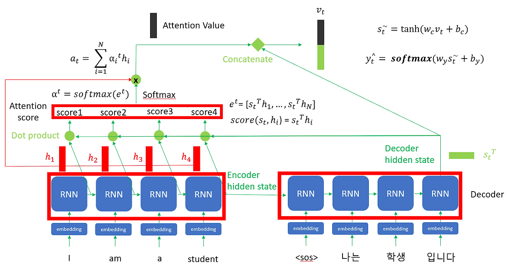

# 10장 - 자연어 처리를 위한 임베딩

### **임베딩(Embedding)**

사람이 사용하는 언어를 컴퓨터가 이해할 수 있는 언어(숫자)형태인 벡터로 변환하는 것

- **희소 표현 기반 임베딩**
    
    **희소 표현(sparse representation)** - 행렬에서 대부분의 값이 0이고 소수만 0이 아닌 형태로 데이터를 나타내는 방식
    
    **원-핫 인코딩(one-hot encoding)** - 전체 단어 수만큼 차원을 설정하고 해당 단어의 인덱스만 1로 나머지는 0으로 표현하는 방식
    
    하나의 요소만 1이고 나머지는 0인 희소벡터를 띄는데 두 단어에 대한 벡터의 내적이 0 값을 가지므로 직교를 이룸 → 단어끼리의 관계성 없이 서로 독립적인 관계
    
    차원의 저주: 단어가 많아지면 차원이 매우 커짐
    
- **횟수 기반 임베딩**
    
    **카운터 벡터(counter vector)** - 단어를 토큰으로 생성하고 각 단어의 출현 빈도수를 이용해 인코딩
    
    **TF-IDF(Term Frequency-Inverse Document Frequency)**
    
    **TF** - 문서 내에서 특정 단어가 출현한 빈도
    
    **IDF - (DF - 한 단어가 나타난 문서 개수) IDF - (DF에 역수와 로그를 취해 자주 등장하는 단어의 가중치를 낮춤)**
    
    → 문서에서 자주 나오지만 코퍼스 전체에서는 희귀한 단어에 가중치를 크게 둠
    
- **예측 기반 임베딩**
    
    특정 문맥에서 어떤 단어가 나올지 예측하면서 단어를 벡터로 만드는 방식
    
    원-핫 인코딩에서 단어의 유사성을 표현할 수 없었지만 워드투벡터로 의미를 수치화 할 수 있음
    
    **워드투벡터(Word2Vec)** 
    
    신경망 알고리즘. 문맥(주변 단어)을 예측하도록 학습해, 각 단어를 의미가 비슷하면 가까워지도록 하는 고정(정적) 밀집 벡터로 변환한다. 유사도 측정에는 보통 **코사인 유사도**를 쓴다.
    
    **코사인 유사도?** - 두 벡터가 이루는 각도의 코사인 값. 방향이 얼마나 비슷한지를 측정하는 지표
    
    일정한 크기의 윈도우로 분할된 텍스트를 입력으로 사용.
    
    **CBOW** 방식과 **Skip-gram**방식이 존재
    
    **CBOW(Continuous Bag Of Wprds) -** 주변에 있는 단어를 가지고 중간에 있는 단어를 예측
    
    Ex)  calm cat slept onthe sofa 문장이 있고 calm cat on the sofa 라는 문맥이 주어지면 slept를 예측하는 것
    
    문장에 n개의 토큰이 있을 때 예측 대상 단어 인덱스는 n//2 → **중심 단어(center word)**, 예측에 사용되는 단어를 **주변 단어(context word)**.
    
    중심단어를 예측하기 위해 주변 단어의 수를 정하게 되는데 이 범위를 **윈도우(window)**라고 함
    
    **skip-gram**
    
    CBOW와 반대로 중간에 있는 단어로 주변 단어들을 예측하는 방식
    
    **패스트텍스트(FastText)**
    
    **워드투백터의 방식**은 분산표현을 이용해 단어의 분산 분포가 유사한 단어들에 비슷한 벡터값을 할당해 표현함 → **사전에 없는 단어에 대해서는 벡터 값을 얻을 수 없음, 자주 사용되지 않은 단어에 대해서는 학습이 불안정함**
    
    **분산 표현** - 단어의 의미를 여러 차원에 분산하여 표현
    
    1. **내부 단어(subword)의 학습**
        
        FastText에서는 각 단어를 n-gram으로 표현
        
    2. **모르는 단어(out of vocabulary)** - n-gram으로 분리된 부분 단어와 유사도를 계산해 의미를 유추할 수 있음
    3. **자주 사용되지 않는 단어** 
        
        Word2Vec에는 등장 빈도가 적은 단어에 대해 참고할 수 있는 경우의 수가 적어 임베딩의 정확도가 높지 않음. FastText의 경우 n-gram으로 인베딩 하기 때문에 참고할 수 있는 경우의 수가 많음. → 오타나 노이즈 많은 데이터에서 강점
        
- 횟수/예측 기반 임베딩
    
    **글로브(GloVe, Global Vectors for Word Representation)**
    
    기존의 횟수 기반반의 LSA(Latent Semantic Analysis)와 예측 기반의 Word2Vec의 단점을 보완한 모델 → 횟수 기반과 예측 기반의 방식을 모두 사용
    
    LSA는 단어 의미의 유츄 작업에는 성능이 떨어지고, Word2Vec는 단어 간 유추작업에는 LSA보다 뛰어나지만 임베딩 벡터가 윈도우 크기 내에서만 주변 단어를 고려하기 때문에 코퍼스의 전체적인 통계 정보를 반영하지 못함.
    

### 트랜스포머 어텐션

어텐션(Attention) - 기존 seq2seq모델에서

1. RNN은 멀리있는 정보를 잡기 어렵고(기울기 소실)
2. 고정 크기 필터에 모든 정보를 담다보니 정보 손실 발생 
    
    → **어텐션**은 해당 시점에서 예측해야할 단어와 연관이 있는 단어 부분을 좀 더 집중(attention)해서 보게 됨
    
    **디코더에서 히든 스테이트와 인코더의 히든 스테이트 간의 내적(dot product)를 구해 어텐션 스코어룰 구하고 softmax를 통과한 다음(Attention distribution), 인코더 히든스테이트와 Attention distribution을 곱하여 합한다음 Attention value행렬(최종 문맥) 구함** 
    
    
    

**트랜스포머(transformer)**

인코더와 디코더를 여러게 중첩시킨 구조

인코더

하나의 인코더는 실프 어텐션(self-attention)과 전방향 신경망(feed forward neural network)로 구성되어 있음

**셀프 어텐션(self-attention)**

모든(이전까지, 다음 단어를 보면 컨닝) 벡터와 내적연산(가중합)을 해 어텐션 스코어 구함 → 거리의 영향을 받지 않음 (단어1과 단어5 관계 파악을 위해 기존 RNN에서는 1,2,3,4,5 과정을 거쳐야 했지만[먼 거리는 소실], 셀프 어텐션은 바로 1,5 관계를 파악할 수 있다]

- seq2seq
    
    입력 시퀀스에 대한 출력 시퀀스를 만들기 위한 모델(ex. 한 문장을 다른 문장으로 변환(번역))
    
    인코더 - 문장을 받아 문장에 대한 정보를 압축한 Context 벡터를 만듬
    
    디코더 - Context 벡터로부터 다른 문장을 생성
    
    Context 벡터는 RNN에서 hidden state와 유사
    
    인코더와 디코더는 RNN으로 구성되어 있음. LSTM이 있다고 가정하면 LSTM의 마지막 은닉상태가 Context 벡터. 
    
    [모델 학습 후 Test단계 디코더 작동] 디코더는 입력 문장을 통해 출력 문장을 예측하는 언어 모델 형식. <sos>(start of string)와 Context벡터가 입력되면 다음 등장할 확률이 가장 높은 단어를 예측
    
    [Training 단계] 교사 강요(teacher forcing) 방식으로 디코더 모델 훈련
    
    보통 RNN은 n-1 스텝의 출력값을 n스텝의 입력으로 사용함. 즉 n-1 스텝에서 RNN모델의 예측한 값을 n스텝의 입력값으로 사용.
    
    하지만 교사 강요는 n-1스텝의 실제 값을 n스텝의 입력으로 사용.
    
    왜? n-1스텝의 예측값이 실제값과 다를 수 있기 때문
    
    인코더에서 RNN을 사용하기 때문에 긴 시퀀스 처리 어려움
    
- BERT
    
    양방향 자연어 처리 모델 - 입력된 순서대로 처리하지 않음. 트랜스포머를 이용해 구현됨.
    
    트랜스포머의 인코더만 사용